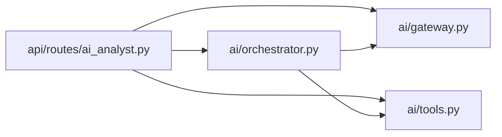

# Axyro: исследование coupling AI-аналитика

**Дата:** 9 октября 2026. **Статус:** статическое исследование выполнено;
отчёт подготовлен для review, выполнение приложения и тестов не проверялось.

## 1. Источник и границы

Пользователь указал репозиторий [demand-upload][repository], ветку main и
четыре файла AI-аналитика. GitHub API вернул commit
`e1a2d010faedf6ba7a5052df47de3463b0cb02af`. Все исходники и ссылки ниже относятся
именно к нему, даже если main впоследствии изменится.

Локальный путь Axyro не потребовался: содержимое прочитано через GitHub API
в память, новый клон и копии исходников на диске не создавались. Обращений
к OpenAI, Google Ads, production-приложению, его БД или очереди не было.
Секреты Axyro не запрашивались; механизм получения ключа изучен только по коду.
Проверенное дерево GitHub не было усечено; AGENTS.md в нём не найден.

| Основной файл | Git blob SHA |
|---|---|
| backend/app/api/routes/ai_analyst.py | cdd5ac6e0a37a54e6075f3b3026faac9c96feb99 |
| backend/app/ai/orchestrator.py | 51896749a153fc83fbce18cdf623f283f5c3d59d |
| backend/app/ai/gateway.py | 692c9376807dfc56e64380c404985555cf15bdcd |
| backend/app/ai/tools.py | ebf25908daccfbbaa0bb3717627ddbcafb78d9e3 |

Дополнительно прочитаны ai/policy.py, ai/providers.py, ai/schemas.py,
ai/security.py и два тестовых файла: test_ai_gateway.py, test_ai_orchestrator.py.
Реализация Control Center, worker, полная модель БД, frontend и deployment
не исследовались: для них отмечены только наблюдаемые входящие зависимости.

## 2. Граф импортов и реальные вызовы

Стрелка означает прямой импорт внутри выбранной четвёрки. Это не диаграмма
сетевых запросов и не полный граф проекта.



Пять связей подтверждены [импортами route][route-imports],
[orchestrator][orchestrator-imports], [gateway][gateway-imports] и
[tools][tools-imports]. Прямого цикла между этими четырьмя модулями нет.
Это не доказывает отсутствие циклов через остальные модули приложения.

Все четыре импортируют ai.schemas и app.db.models. Route, orchestrator и tools
также используют policy и redact из ai.security. Tools зависит от
control_center.query/service, а policy — от providers и period_bounds.

Основной сценарий [stream_message()][route-stream]:

1. Route получает пользователя, CSRF и SQLAlchemy Session через Depends,
   проверяет владельца диалога и доступность AI. По request_id возможен возврат
   ранее созданного запуска. Для нового запуска сохраняются USER-сообщение и
   AiRun, через resolve_tool_context() формируется серверный ToolContext.
2. Route делает commit и вызывает run_analysis(db, context, text, profile,
   emit=...). Один объект Session передаётся дальше по цепочке.
3. [Orchestrator][orchestrator-run] проверяет лимиты, загружает AiRun и профиль,
   устанавливает RUNNING, выбирает переданные gateway/registry либо создаёт
   build_gateway(db)/ToolRegistry(). Registry.schemas_for(context, db)
   формирует разрешённые схемы инструментов.
4. gateway.turn(...) вызывает [OpenAIResponsesGateway.turn()][gateway-turn],
   который обращается к self.client.responses.parse(...), задаёт
   AiStructuredAnswer, store=False и parallel_tool_calls=False. Ответ SDK
   преобразуется в GatewayTurn с FunctionCall и учётом токенов.
5. Для function call orchestrator вызывает registry.get(call.name), проверяет
   повторы/лимиты и затем registry.execute(...). [Registry][registry-execute]
   повторно проверяет права, разбирает JSON, валидирует args_model и вызывает
   spec.handler(db, context, arguments). Имя, пришедшее от модели, разрешается
   через каталог, а не превращается в произвольную Python-функцию.
6. Orchestrator сохраняет AiToolCall, передаёт function_call_output в следующий
   ход gateway, затем валидирует итог, сохраняет ASSISTANT-сообщение и usage.
   В коде предусмотрены частичный ответ, отмена и fallback на FAST при некоторых
   ошибках провайдера; их фактическое выполнение здесь не проверялось.
7. Route выдаёт SSE: connected, накопленные события, фрагменты текста и
   message.completed; ошибки обрабатывает через fail_run и redact.

Пример конкретного разрешения вызова: строка find_accounts в
[каталоге][catalog] связывается с AccountFilterArgs и _find_accounts.
Обработчик [проверяет account_ids и вызывает _account_rows][find-accounts];
последний использует ORM и [функции Control Center][account-rows].
Gateway непосредственно этот обработчик не вызывает: решение исполняет registry.

AST каталога содержит **35 ToolSpec**: 18 READ, 3 QUEUED_REFRESH,
9 DRAFT и 5 PREVIEW. Это полный каталог в исходнике, а не число инструментов,
доступных конкретному пользователю: schemas_for фильтрует его по policy.

## 3. Где компоненты связаны и что это означает

Coupling — зависимость компонента от контрактов, данных или порядка работы
других компонентов. Само наличие связи не является ошибкой; важно понимать,
какое изменение потребует согласованной правки в нескольких местах.

| Наблюдаемая связь | Следствие изменения |
|---|---|
| Route знает run_analysis, fail_run, ToolContext, ORM и SSE-представление | Изменение сигнатуры запуска или формы итогового ответа затрагивает HTTP-адаптер, а не только orchestrator |
| Gateway принимает ORM AiModelProfile; build_gateway читает настройки/БД | Protocol уменьшает зависимость от SDK, но транспорт ещё связан со способом хранения конфигурации |
| AiStructuredAnswer используется SDK, orchestrator и route | Новое обязательное поле требует согласовать parse, валидацию, создание частичного ответа и сериализацию; frontend здесь не проверен |
| ToolSpec связывает строковое имя, args_model, risk и handler | Переименование инструмента или аргумента меняет контракт модели, registry и тестов; типизация не устраняет строковую связь |
| _account_rows использует account_payload и monitoring_state_map | Изменение структуры метрик Control Center может изменить данные find_accounts, даже без изменения его публичного имени |
| Общая Session и commit в нескольких компонентах | Перенос commit способен изменить момент сохранения запуска, аудита и задач; весь запрос нельзя считать одной атомарной транзакцией |

Последний вывод подтверждается commit в route:376, orchestrator:69/197/238
и tools:1203. В [refresh-обработчике][refresh] commit стоит перед локальным
импортом app.jobs.control_center_tasks и run_control_center_sync.delay(...).
Наблюдается связь БД → постановка задания. Возможное окно между сохранением
и отправкой в очередь требует отдельной проверки отказов; сбой доставки
в этом исследовании не воспроизводился, устройство worker не проверялось.

**Участок имеет побочные эффекты при исполнении.** READ-инструменты читают
снимки, но [draft-обработчик][draft] добавляет AiDraft, а QUEUED_REFRESH
создаёт Job/ControlCenterSyncRun и вызывает очередь. READ_ONLY в policy не
означает запрет любых локальных записей: для QUEUED_REFRESH отдельно проверяется
роль. [authorize_tool][authorize] ограничивает роли, режимы и feature flags.
Применение draft находится в [отдельном endpoint][apply-draft]. Это наблюдение
о коде, не доказательство безопасности всех ролей и всех возможных состояний.

Есть две дополнительные связи, которые простой рисунок «route → orchestrator
→ gateway» скрывает:

- [Route /capabilities][capabilities] сам создаёт ToolRegistry. Изменение
  каталога затрагивает и описание возможностей HTTP API.
- [Route /transcribe][transcribe] локально импортирует OpenAI и вызывает
  audio.transcriptions.create напрямую, используя get_openai_api_key из
  gateway. Следовательно, замена OpenAI для всего файла route потребует
  учесть и голосовой путь. Он не входит в run_analysis.

Кроме того, [create_preview_from_draft][preview] импортирует preview_action
из другого route и вызывает его напрямую. Это связь HTTP-обработчиков через
Python-сигнатуру. Полнота проверок вызываемого endpoint здесь не оценивалась.

**SSE и порядок выполнения:** callback складывает события в timeline;
цикл yield этих событий расположен после возврата run_analysis. Текст тоже
нарезается после получения answer. Поэтому в данном коде connected отправляется
раньше, но промежуточные события анализа буферизуются; утверждать непрерывную
передачу прогресса во время gateway.turn нельзя. Реальное поведение браузера,
прокси и разрыва соединения не измерялось.

## 4. Что уже уменьшает coupling и что можно улучшить

Уже есть ResponsesGateway Protocol, GatewayTurn/FunctionCall, внедряемые
gateway и registry, отдельная policy, типизированные схемы и явный каталог.
Это позволяет подставлять транспорт/инструменты без реального внешнего вызова.
При этом input_items/tools остаются словарями формата Responses API,
а registry в сигнатуре run_analysis указан конкретным ToolRegistry.

Варианты ниже — предложения для отдельной задачи Axyro, не согласованные
изменения и не выполненный рефакторинг.

| Вариант | Польза | Trade-off |
|---|---|---|
| Выделить настройки запроса модели в небольшой DTO, получать их до gateway | Убирает ORM AiModelProfile из транспортного контракта | Добавляет преобразование и второй тип данных; оправдано при смене транспорта/хранения |
| Явно определить владельца commit; отдельно проверить сохранение + очередь | Делает порядок побочных эффектов понятнее и проверяемее | Меняет важную семантику отказов; нужны integration/failure tests, для гарантированной доставки может понадобиться outbox |
| Разделить registry и группы обработчиков READ/DRAFT/REFRESH, сохранив имена/схемы | Уменьшает число причин менять большой tools.py | Само разнесение по файлам не убирает зависимость от Control Center и БД |
| Вынести совместную preview-операцию из route в сервис | Route перестают вызывать друг друга | Нужно сохранить проверки владельца, роли, CSRF на HTTP-границе и бизнес-проверки в сервисе |
| Описать типы событий и контракт SSE; выбрать буферизацию либо живой прогресс | Изменение событий меньше затрагивает неявные словари и UI | Живой прогресс усложняет управление Session, отменой, очередью событий и отключением клиента |

Первый практический шаг — зафиксировать контракт и проверки побочных эффектов,
а не сразу переносить весь модуль на новую архитектуру.

## 5. Возможности и ограничения статического анализа

**Проверено:** текст импортов, определения функций, явные места вызовов,
конструкторы ToolSpec, порядок commit/delay/yield и наличие защитных проверок.
Четыре основных файла успешно разобраны ast.parse без импортирования Axyro.
AST подтвердил пять внутренних импортных связей, выбранные call sites и
35 записей каталога. Blob SHA повторного чтения совпали с исходными.

Для повторения достаточно читать GitHub ref, затем содержимое по зафиксированному
SHA; команды ниже не изменяют репозиторий:

```powershell
gh api repos/ruiskhakov2017-sys/demand-upload/git/ref/heads/main --jq '.object.sha'
gh api 'repos/ruiskhakov2017-sys/demand-upload/contents/backend/app/ai/orchestrator.py?ref=e1a2d010faedf6ba7a5052df47de3463b0cb02af' --jq '{sha, encoding, content}'
```

Полученный Base64 декодировался как UTF-8. Собственный проверочный скрипт
использовал ast.parse и ast.walk с Import/ImportFrom/Call; код модулей не
исполнялся. Python запускался с -I -B. Первая попытка разбора прервалась из-за
кодировки канала PowerShell → Python; передача JSON через ASCII Base64 решила
проблему. Это ошибка проверочного канала, а не установленный дефект Axyro.
Один GitHub-запрос получил TLS handshake timeout; обычное повторное чтение
прошло, проверка TLS не отключалась.

**Ограничения:**

- ast.parse подтверждает синтаксис для использованного Python 3.14.8, но не
  установку зависимостей, разрешение всех импортов или совместимость runtime Axyro.
- registry.execute выбирает handler по строке, а gateway может быть подменён.
  Каталог позволяет восстановить стандартные кандидаты, но не фактический путь
  конкретного запроса. Количество доступных инструментов зависит от БД и policy.
- AST видит локальные импорты openai и worker; простой поиск только верхних
  импортов их пропустил бы. Межпроцедурный и полный межмодульный граф не строился.
- Не доказаны корректность модели, отсутствие prompt injection/утечки,
  актуальность метрик, права на реальные данные, лимиты стоимости, конкурентная
  идемпотентность, rollback, доставка очереди или задержки SSE.
- Содержимое [gateway-тестов][gateway-tests] подтверждает подстановку client
  и проверку аргументов parse. [Orchestrator-тесты][orchestrator-tests]
  используют FakeGateway/FakeRegistry/FakeDb и monkeypatch, предусматривают
  повторы, неизвестный инструмент, partial answer, timeout, fallback и отмену.
  Тесты только прочитаны: статус PASS и их покрытие production не заявляются.

## 6. Итог и связь с документами KazanCourts

Исследование указанного участка выполнено: установлены импорты, цепочка
вызовов, контракты, побочные эффекты и ограничения выводов. Кода Axyro не
меняли и не запускали; новый клон не создавали. Изменение Git-состояния Axyro
через API не выполнялось. Этот отчёт не является приёмкой Axyro или аудитом
безопасности всего приложения.

[План](axyro-coupling-plan.md) сохранён как исходный план от 7 октября.
Его статус «не начата», как и прежняя запись в
[testing-report](testing-report.md), описывает состояние до отдельного поручения
9 октября. Текущий результат исследования зафиксирован в этом файле.

Три локальных документа завершения проверены: ссылки существуют,
PowerShell-блок сценария синтаксически корректен, git diff --check проходит.
Публикационные SHA согласуются с локальным Git и проверкой GitHub от 8 октября;
нового CI или демонстрации в рамках исследования не запускали. В
[acceptance-demo](acceptance-demo.md) фразу «полностью внутри календарного месяца»
лучше уточнить как «весь интервал не позднее now + один календарный месяц
по Казани»: именно это делает bookings/validators.py, а не ограничение концом
текущего месяца. Это замечание review; три исходных документа не исправлялись.

Обязательный артефакт docs/axyro-coupling-note.md теперь подготовлен.
Его review, commit и публикация ещё не выполнены. Homework Defense и mentor
review не заменяются наличием этого файла и не объявляются завершёнными.

[repository]: https://github.com/ruiskhakov2017-sys/demand-upload/tree/e1a2d010faedf6ba7a5052df47de3463b0cb02af
[route-imports]: https://github.com/ruiskhakov2017-sys/demand-upload/blob/e1a2d010faedf6ba7a5052df47de3463b0cb02af/backend/app/api/routes/ai_analyst.py#L20-L40
[orchestrator-imports]: https://github.com/ruiskhakov2017-sys/demand-upload/blob/e1a2d010faedf6ba7a5052df47de3463b0cb02af/backend/app/ai/orchestrator.py#L14-L28
[gateway-imports]: https://github.com/ruiskhakov2017-sys/demand-upload/blob/e1a2d010faedf6ba7a5052df47de3463b0cb02af/backend/app/ai/gateway.py#L10-L13
[tools-imports]: https://github.com/ruiskhakov2017-sys/demand-upload/blob/e1a2d010faedf6ba7a5052df47de3463b0cb02af/backend/app/ai/tools.py#L17-L80
[route-stream]: https://github.com/ruiskhakov2017-sys/demand-upload/blob/e1a2d010faedf6ba7a5052df47de3463b0cb02af/backend/app/api/routes/ai_analyst.py#L308-L410
[orchestrator-run]: https://github.com/ruiskhakov2017-sys/demand-upload/blob/e1a2d010faedf6ba7a5052df47de3463b0cb02af/backend/app/ai/orchestrator.py#L47-L248
[gateway-turn]: https://github.com/ruiskhakov2017-sys/demand-upload/blob/e1a2d010faedf6ba7a5052df47de3463b0cb02af/backend/app/ai/gateway.py#L37-L135
[registry-execute]: https://github.com/ruiskhakov2017-sys/demand-upload/blob/e1a2d010faedf6ba7a5052df47de3463b0cb02af/backend/app/ai/tools.py#L93-L176
[catalog]: https://github.com/ruiskhakov2017-sys/demand-upload/blob/e1a2d010faedf6ba7a5052df47de3463b0cb02af/backend/app/ai/tools.py#L179-L463
[find-accounts]: https://github.com/ruiskhakov2017-sys/demand-upload/blob/e1a2d010faedf6ba7a5052df47de3463b0cb02af/backend/app/ai/tools.py#L523-L552
[account-rows]: https://github.com/ruiskhakov2017-sys/demand-upload/blob/e1a2d010faedf6ba7a5052df47de3463b0cb02af/backend/app/ai/tools.py#L1303-L1366
[refresh]: https://github.com/ruiskhakov2017-sys/demand-upload/blob/e1a2d010faedf6ba7a5052df47de3463b0cb02af/backend/app/ai/tools.py#L1148-L1218
[draft]: https://github.com/ruiskhakov2017-sys/demand-upload/blob/e1a2d010faedf6ba7a5052df47de3463b0cb02af/backend/app/ai/tools.py#L1221-L1300
[authorize]: https://github.com/ruiskhakov2017-sys/demand-upload/blob/e1a2d010faedf6ba7a5052df47de3463b0cb02af/backend/app/ai/policy.py#L207-L246
[apply-draft]: https://github.com/ruiskhakov2017-sys/demand-upload/blob/e1a2d010faedf6ba7a5052df47de3463b0cb02af/backend/app/api/routes/ai_analyst.py#L469-L486
[capabilities]: https://github.com/ruiskhakov2017-sys/demand-upload/blob/e1a2d010faedf6ba7a5052df47de3463b0cb02af/backend/app/api/routes/ai_analyst.py#L90-L104
[transcribe]: https://github.com/ruiskhakov2017-sys/demand-upload/blob/e1a2d010faedf6ba7a5052df47de3463b0cb02af/backend/app/api/routes/ai_analyst.py#L993-L1047
[preview]: https://github.com/ruiskhakov2017-sys/demand-upload/blob/e1a2d010faedf6ba7a5052df47de3463b0cb02af/backend/app/api/routes/ai_analyst.py#L489-L530
[gateway-tests]: https://github.com/ruiskhakov2017-sys/demand-upload/blob/e1a2d010faedf6ba7a5052df47de3463b0cb02af/backend/tests/test_ai_gateway.py#L36-L89
[orchestrator-tests]: https://github.com/ruiskhakov2017-sys/demand-upload/blob/e1a2d010faedf6ba7a5052df47de3463b0cb02af/backend/tests/test_ai_orchestrator.py#L150-L362
